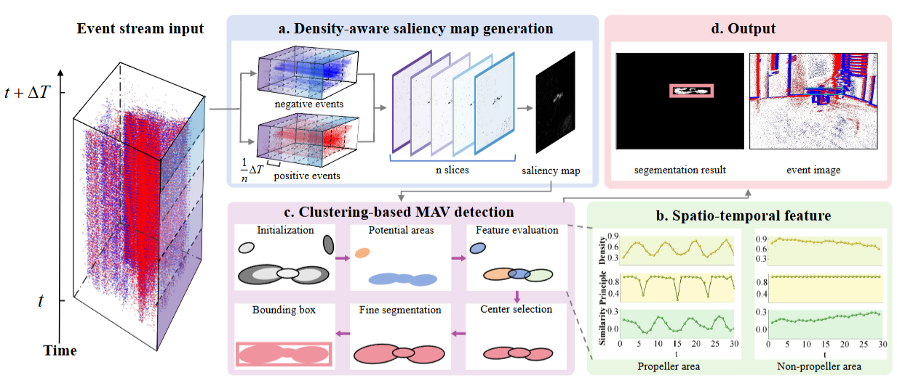
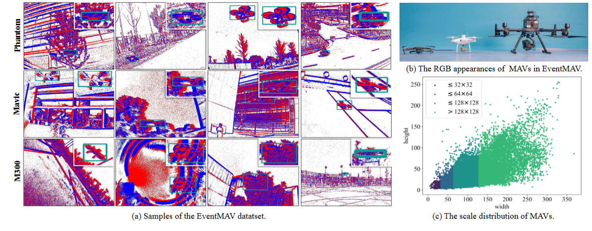

  <h1>EvDetMAV: Generalized MAV Detection from Moving Event Cameras</h1>

This is the repository for the paper "EvDetMAV: Generalized MAV Detection from Moving Event Cameras". This paper has been officially accepted by IEEE Robotics and Automation Letters.

This paper focuses on detecting different types of micro aerial vehicles (MAVs) from event cameras because their fast-rotating propellers have common and unique features in the event stream. 
Therefore, we propose a novel method called EvDetMAV to fully exploit the saliency and spatio-temporal features of the propellers from the point-based event stream. Besides, we also establish
a novel dataset called EventMAV for the community. This is the first event-based MAV detection dataset containing multiple types of MAVs and diverse environments.

### Framework

### Dataset

The Phantom subset can be downloaded at:[EventMAV](https://pan.baidu.com/s/1OUGuZNKM5nJNiG96Ow2zYg?pwd=yk8i)Password: yk8i
### Code

### Contact
If you have any problem when using this dataset, please feel free to contact: [zhangyin@westlake.edu.cn](mailto:zhangyin@westlake.edu.cn).
